# Diagram Renderer

A comprehensive diagram rendering service supporting Mermaid, PlantUML, and Graphviz diagrams with an interactive web interface:

- **Streamlit Dashboard** - Interactive web interface for diagram rendering

## Features

- Automatic diagram type detection (Mermaid, PlantUML, Graphviz)
- Static Mermaid.js assets (version controlled)
- VizJS for Graphviz/DOT rendering
- PlantUML to DOT conversion and rendering
- Multiple themes for Mermaid diagrams
- Interactive Streamlit dashboard

## Installation

```bash
uv install
```

## Usage

### Examples

The `examples/` directory contains two demonstration applications:

**Streamlit Dashboard** - Interactive web interface:
```bash
uv sync --extra dashboard
uv run --extra dashboard python -m streamlit run examples/dashboard.py
```

**Command Line Interface** - Batch processing and automation:
```bash
# Render diagram from file
uv run python examples/cli.py render diagram.mmd

# Quick inline rendering
uv run python examples/cli.py quick "graph TD; A-->B"

# Show examples and help
uv run python examples/cli.py examples
uv run python examples/cli.py --help
```

## Supported Diagram Types

### Mermaid
- Flowcharts, Sequence diagrams, Class diagrams
- State diagrams, ER diagrams, User journey
- Gantt charts, Pie charts, and more

### PlantUML
- UML diagrams (Class, Sequence, Use Case, Activity)
- Network diagrams, Mind maps
- Gantt charts, Work breakdown structure

### Graphviz
- DOT language diagrams
- Directed and undirected graphs
- Network diagrams, organizational charts

## Configuration

### Mermaid Themes
- `default` - Default theme
- `base` - Base theme
- `dark` - Dark theme
- `forest` - Forest theme
- `neutral` - Neutral theme

## Development

The main components are:

- `diagram/` - Core diagram rendering logic and renderers
- `st_diagram.py` - Streamlit diagram component wrapper
- `examples/cli.py` - Command-line interface and dashboard launcher
- `examples/dashboard.py` - Streamlit web interface
- `diagram/renderers/static/js/` - Static JavaScript assets (Mermaid.js, VizJS)

## Live Demo

**Input:**

```mermaid
flowchart LR
    A[diagram-renderer] --> B{Auto-detect}
    B -->|Mermaid| C[Mermaid.js]
    B -->|PlantUML| D[PlantUML → DOT]
    B -->|Graphviz| E[VizJS]
    C --> F[Interactive HTML]
    D --> F
    E --> F
    F --> G[📱 Responsive]
    F --> H[🖼️ PNG Export]
    F --> I[🔍 Zoom/Pan]
```


**Output:** Interactive HTML with zoom/pan controls, responsive design, and PNG export:

```html
<!DOCTYPE html>
<html>
<head>
    <style>
        body {
            margin: 0;
            padding: 0;
            font-family: Arial, sans-serif;
            background-color: transparent;
            height: 100vh;
            width: 100%;
            min-height: 500px;
            overflow: hidden;
            position: relative;
        }
        .diagram-container {
            position: relative;
            width: 100%;
            height: 100%;
            overflow: hidden;
            cursor: grab;
        }
        .diagram-container:active {
            cursor: grabbing;
        }
        .zoom-controls {
            position: absolute;
            top: 10px;
            right: 10px;
            z-index: 1000;
            background: rgba(255, 255, 255, 0.9);
            border-radius: 8px;
            padding: 8px;
            box-shadow: 0 2px 8px rgba(0,0,0,0.2);
            display: flex;
            flex-direction: column;
            gap: 4px;
        }
        .zoom-btn {
            background: #007bff;
            color: white;
            border: none;
            border-radius: 4px;
            width: 32px;
            height: 32px;
            cursor: pointer;
            font-size: 16px;
            font-weight: bold;
            display: flex;
            align-items: center;
            justify-content: center;
        }
        .zoom-btn:hover {
            background: #0056b3;
        }
        .mermaid-container {
            width: 100%;
            height: 100%;
            display: flex;
            justify-content: center;
            align-items: center;
            overflow: visible;
            transform-origin: center center;
            transition: transform 0.1s ease;
        }
        .mermaid {
            width: auto;
            height: auto;
            text-align: center;
            overflow: visible;
        }
    </style>
    <script src="diagram_renderer/renderers/static/js/mermaid.min.js"></script>
</head>
<body>
    <div class="diagram-container">
        <div class="zoom-controls">
            <button class="zoom-btn" onclick="zoomIn()">+</button>
            <div class="zoom-level" id="zoom-level">100%</div>
            <button class="zoom-btn" onclick="zoomOut()">−</button>
            <button class="zoom-btn" onclick="resetZoom()" title="Reset">⌂</button>
            <button class="zoom-btn" id="download-btn" onclick="downloadPNG()" title="Download PNG">📥</button>
            <button class="zoom-btn" onclick="downloadCode()" title="Download Source Code">📄</button>
        </div>
        <div class="mermaid-container" id="mermaid-container">
            <div class="mermaid">
flowchart LR
    A[diagram-renderer] --> B{Auto-detect}
    B -->|Mermaid| C[Mermaid.js]
    B -->|PlantUML| D[PlantUML → DOT]
    B -->|Graphviz| E[VizJS]
    C --> F[Interactive HTML]
    D --> F
    E --> F
    F --> G[📱 Responsive]
    F --> H[🖼️ PNG Export]
    F --> I[🔍 Zoom/Pan]
            </div>
        </div>
    </div>
    <script>
        // Interactive zoom/pan functionality with PNG export
        const mermaidContainer = document.getElementById('mermaid-container');
        const zoomLevelDisplay = document.getElementById('zoom-level');
        
        let currentZoom = 1.0;
        let currentPanX = 0;
        let currentPanY = 0;
        let isDragging = false;
        let lastMouseX = 0;
        let lastMouseY = 0;
        
        function updateTransform() {
            mermaidContainer.style.transform = `translate(${currentPanX}px, ${currentPanY}px) scale(${currentZoom})`;
            zoomLevelDisplay.textContent = Math.round(currentZoom * 100) + '%';
        }
        
        function zoomIn() {
            currentZoom = Math.min(currentZoom * 1.2, 3.0);
            updateTransform();
        }
        
        function zoomOut() {
            currentZoom = Math.max(currentZoom / 1.2, 0.1);
            updateTransform();
        }
        
        function resetZoom() {
            currentZoom = 1.0;
            currentPanX = 0;
            currentPanY = 0;
            updateTransform();
        }
        
        // Mouse drag pan functionality
        mermaidContainer.addEventListener('mousedown', function(e) {
            isDragging = true;
            lastMouseX = e.clientX;
            lastMouseY = e.clientY;
            e.preventDefault();
        });
        
        document.addEventListener('mousemove', function(e) {
            if (isDragging) {
                const deltaX = e.clientX - lastMouseX;
                const deltaY = e.clientY - lastMouseY;
                currentPanX += deltaX;
                currentPanY += deltaY;
                lastMouseX = e.clientX;
                lastMouseY = e.clientY;
                updateTransform();
            }
        });
        
        document.addEventListener('mouseup', function() {
            isDragging = false;
        });
        
        // Initialize Mermaid
        document.addEventListener('DOMContentLoaded', function() {
            mermaid.initialize({
                startOnLoad: false,
                theme: 'default',
                securityLevel: 'loose'
            });
            
            const mermaidElements = document.querySelectorAll('.mermaid');
            mermaidElements.forEach(async (element, index) => {
                try {
                    const id = 'mermaid-' + index;
                    const {svg} = await mermaid.render(id, element.textContent);
                    element.innerHTML = svg;
                    updateTransform();
                } catch (error) {
                    element.innerHTML = '<div style="color: red;">Error rendering diagram</div>';
                }
            });
        });
    </script>
</body>
</html>
```

## Examples

### Mermaid Flowchart


### PlantUML Class Diagram


### Graphviz DOT Diagram
