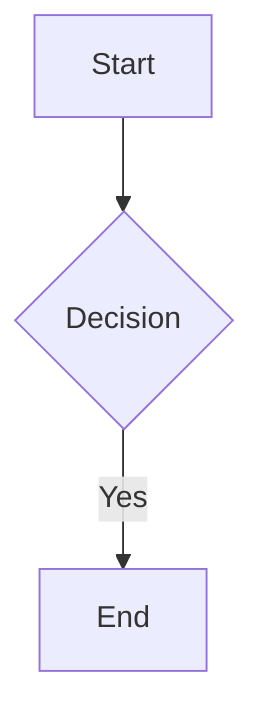
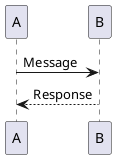
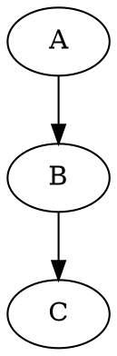

# Diagram Renderer MCP Server

A Model Context Protocol (MCP) server that provides diagram rendering capabilities to AI assistants. This allows AI tools like Claude Desktop to generate interactive HTML diagrams from Mermaid, PlantUML, and Graphviz code.

## Features

- **🎨 Multi-format Support**: Render Mermaid, PlantUML, and Graphviz diagrams
- **🤖 AI Integration**: Seamless integration with Claude Desktop and other MCP clients
- **🔍 Auto-detection**: Automatically detect diagram type from source code
- **✅ Validation**: Validate diagram syntax and provide helpful error messages
- **📚 Examples**: Built-in example library for all supported diagram types
- **🖼️ Interactive Output**: Generated HTML includes zoom, pan, and download controls

## Installation

```bash
# Install MCP dependencies
uv sync --extra mcp

# Or install all dependencies
uv sync --extra all
```

## Usage

### Command Line

```bash
# Start the MCP server
uv run --extra mcp python examples/cli.py mcp

# Or run directly
uv run --extra mcp python examples/mcp_server.py
```

### Claude Desktop Integration

Add to your Claude Desktop configuration (`~/Library/Application Support/Claude/claude_desktop_config.json` on macOS):

```json
{
  "mcpServers": {
    "diagram-renderer": {
      "command": "uv",
      "args": [
        "run", 
        "--extra", "mcp",
        "python", 
        "/path/to/diagram-render/examples/mcp_server.py"
      ],
      "cwd": "/path/to/diagram-render"
    }
  }
}
```

### Other MCP Clients

The server communicates via stdio using the Model Context Protocol. Any MCP-compatible client can use it by running the command above and communicating over stdin/stdout.

## Available Tools

### `render_diagram`

Render a diagram from source code to interactive HTML.

**Parameters:**
- `code` (required): The diagram source code
- `diagram_type`: Type of diagram ("auto", "mermaid", "plantuml", "graphviz")
- `save_to_file`: Whether to save HTML to a temporary file
- `include_controls`: Whether to include interactive controls

**Example:**
```
User: Create a flowchart showing a simple web request process

AI: I'll create a flowchart for a web request process using the diagram renderer.

[calls render_diagram with Mermaid code]

✅ Successfully rendered mermaid (234 chars → 2,847,123 chars HTML)
```

### `detect_diagram_type`

Detect the type of diagram from source code.

**Parameters:**
- `code` (required): The diagram code to analyze

**Example:**
```
User: What type of diagram is this code?

AI: [calls detect_diagram_type]

🎯 Detected diagram type: **MERMAID**

Mermaid diagrams support flowcharts, sequence diagrams, class diagrams, and more.
```

### `validate_diagram`

Validate diagram syntax and check for potential issues.

**Parameters:**
- `code` (required): The diagram code to validate
- `diagram_type`: Type of diagram ("auto", "mermaid", "plantuml", "graphviz")

**Example:**
```
AI: [calls validate_diagram]

📋 Validation Results for mermaid diagram:

✅ No issues found! Diagram appears valid.

📊 Stats:
  • Length: 156 characters  
  • Lines: 6
  • Type: mermaid
```

## Available Resources

### `diagram://examples`

JSON collection of example diagrams for all supported types:

- **Mermaid**: flowchart, sequence, class diagrams
- **PlantUML**: class, sequence, usecase diagrams  
- **Graphviz**: simple, flowchart, network diagrams

### `diagram://supported-types`

Information about supported diagram types, syntax, and capabilities.

## Example Interactions

### Creating a System Architecture Diagram

```
User: Create a system architecture diagram showing a web app with database and API

AI: I'll create a system architecture diagram using Graphviz.

[calls render_diagram with Graphviz code]

✅ Successfully rendered graphviz (445 chars → 1,923,456 chars HTML)

The diagram shows:
- Web Server connected to Database
- API Gateway connecting multiple clients
- Clear visual separation of components

Usage Instructions:
• Save the HTML to a file (e.g., diagram.html) and open in a browser
• Interactive controls: zoom (+/-), pan (arrow keys), reset (↻)
• Download PNG: click the 🖼 button
• Copy source code: click the ⧉ button
```

### Validating Diagram Syntax

```
User: Check if this PlantUML code is correct: [paste code]

AI: [calls validate_diagram]

📋 Validation Results for plantuml diagram:

⚠️ Warnings:
  • PlantUML diagrams typically end with @enduml

📊 Stats:
  • Length: 89 characters
  • Lines: 4  
  • Type: plantuml

The diagram will render, but adding @enduml at the end would follow PlantUML conventions.
```

## Generated HTML Features

All rendered diagrams include:

- **🔧 Interactive Controls**: GitHub-style zoom, pan, and navigation controls
- **📱 Responsive Design**: Works on desktop and mobile
- **🖼️ PNG Export**: Built-in PNG download functionality  
- **📋 Source Copy**: Copy original diagram code
- **🎨 Clean Styling**: Professional appearance matching GitHub's design
- **🔒 Self-contained**: All JavaScript libraries included locally
- **🌐 UTF-8 Encoding**: Proper Unicode support for international content

## Supported Diagram Types

### Mermaid


### PlantUML  


### Graphviz


## Error Handling

The MCP server provides detailed error messages for:

- **Syntax Errors**: Clear description of syntax issues
- **Missing Dependencies**: Instructions for installing requirements
- **Rendering Failures**: Specific error details with suggestions
- **Invalid Parameters**: Validation of tool inputs

## Security

- **Safe Rendering**: All diagram rendering happens in isolated processes
- **No External Calls**: Self-contained with local JavaScript libraries
- **Input Validation**: All inputs are validated before processing
- **Temporary Files**: Optional temporary files are created securely

## Troubleshooting

### MCP Server Won't Start

```bash
# Check dependencies
uv sync --extra mcp

# Test import
python -c "import mcp; print('MCP installed successfully')"

# Run with verbose output
uv run --extra mcp python examples/mcp_server.py
```

### Claude Desktop Not Connecting

1. Check configuration file path and syntax
2. Verify absolute paths in configuration
3. Restart Claude Desktop after configuration changes
4. Check Claude Desktop logs for connection errors

### Diagram Won't Render

1. Use `validate_diagram` tool to check syntax
2. Try `detect_diagram_type` to verify type detection
3. Check for special characters or encoding issues
4. Start with simple examples from the resources

## Development

To extend the MCP server:

1. **Add Tools**: Implement new functions in `mcp_server.py`
2. **Add Resources**: Extend the resource handlers
3. **Improve Validation**: Add more sophisticated syntax checking
4. **Custom Rendering**: Modify the HTML template generation

## Performance

- **Cold Start**: ~2-3 seconds for first diagram render
- **Warm Renders**: <500ms for subsequent diagrams
- **Memory Usage**: ~50MB base + ~10MB per large diagram
- **Output Size**: 14KB-5MB HTML depending on embedded vs external JS

## License

Same as the main diagram-renderer project (MIT License).